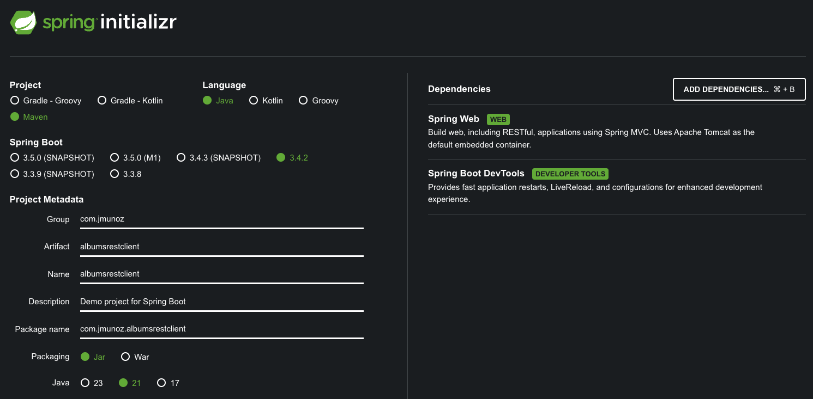

# SPRING BOOT 3 COOKBOOK

Aplicación cliente hecha en Spring Boot que consume un API RESTful.

Se usa `Spring Boot` y `RestClient`.

## Creación de proyecto

Uso Spring Initializr: `https://start.spring.io/`



## Ejecución del proyecto

- Clonar/descargar este proyecto
- Clonar/descargar y ejecutar el proyecto backend `Spring-Boot-football-cards`
  - https://github.com/JoseManuelMunozManzano/Spring-Boot-football-cards
  - Ver su archivo `README.md`
- Ejecutar este proyecto con el comando: `./mvnw spring-boot:run -Dspring-boot.run.arguments=--server.port=8081` para evitar conflictos de puertos
    - O ejecutar directamente desde IntelliJ Idea
- Ejecutar los tests con el comando: `./mvnw test`
  - O ejecutar directamente desde IntelliJ Idea
  - O se ejecutan los goals `package` o `install` de Maven, salvo que explícitamente se deshabilite la ejecución de tests
- En la carpeta `postman` se encuentran los endpoints para probar

## Uso de Spring Boot y RestClient para consumir un API RESTful

Consumimos los endpoints del proyecto backend football: `https://github.com/JoseManuelMunozManzano/Spring-Boot-football-cards`.

`RestClient` es un componente introducido en Spring Framework 6.1 y disponible en Spring Boot desde la versión 3.2.

Usando el componente `RestClient`, obtendremos un API fluido (se usa el resultado de un método para encadenarlo en la llamada a otro método) que ofrece una abstracción sobre bibliotecas HTTP.

Permite convertir desde objetos Java a peticiones HTTP, y al revés, crear objetos Java desde respuestas HTTP.

Creamos un paquete `config` y dentro el archivo de configuración `AlbumsConfiguration.java` donde definimos un bean `RestClient`.

Creamos un paquete `model` y dentro el record `Player.java`.

Creamos un paquete `service` y dentro el servicio `FootballClientService.java`.

Creamos un paquete `controllers` y dentro el controlador `AlbumsController.java`.

## Mocking de un API RESTful

Vamos a usar `Wiremock` para crear tests aislados de nuestra aplicación Albums.

Wiremock es una biblioteca de testing para hacer mock de APIs.

Los pasos son:

- Añadimos la dependencia `Wiremock` a nuestro proyecto Albums, con scope con valor test, ya que Wiremock solo se usa en tests
  - Usamos el artifactId `wiremock-standalone` porque hay una incompatibilidad. Spring Boot usa Jetty 12 y WireMock depende de Jetty 11
    ```xml
    <dependency>
      <groupId>com.github.tomakehurst</groupId>
      <artifactId>wiremock-standalone</artifactId>
      <version>3.0.1</version>
      <scope>test</scope>
    </dependency>
    ```
- Creamos una clase de test `FootballClientServiceTest.java`
  - Usamos la anotación `@SpringBootTest`, ya que usa el contexto de SpringBoot y entonces permite pasar variables de entorno personalizadas usando el campo `properties`. En este caso pasamos la dirección del servidor remoto
- Configuramos un server Wiremock en el test
- Declaramos un campo `FootballClientService`, anotado con `@Autowired` que será inyectado por Spring Boot
- Escribimos un test para validar el método `getPlayer()`